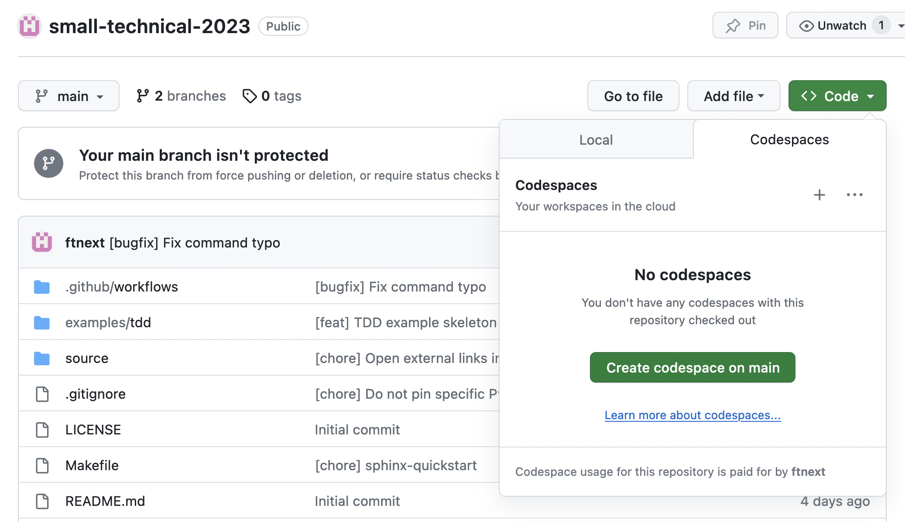

# XP祭り2023 小さなテクニカルプラクティスのワークショップ

https://confengine.com/conferences/xp2023/proposal/18830 のリポジトリです。  
*小さいは正義、なんだよ！* **小さいTDD**や**小さいリファクタリング**を一緒に体験しましょう〜

## 環境構築

Python環境 + VS Codeが必要です。

### [推奨] GitHub Codespaces

GitHubで Code > Codespaces > Create codespace on main

* ブラウザでVS CodeのUIのページが立ち上がります
* Pythonが使える環境です（Dockerイメージ）

### ローカル開発環境

Python環境については案内記事をどうぞ  
https://nikkie-ftnext.hatenablog.com/entry/xpjug-2023-small-technical-practices-workshop-python-guide  
**仮想環境を有効にした状態で**進めてください
（codespaceは使い捨てなので仮想環境の使用はどちらでもかまいませんが、ローカル環境の場合は仮想環境を使いましょう。詳しくは案内記事へ）

このリポジトリをcloneしてください

VS Codeのインストール：https://code.visualstudio.com/download

### 準備ができたら

Python環境とVS Codeが準備できたら [ようこそ！の「環境構築」](https://ftnext.github.io/small-technical-2023/introduction.html) に合流します。  
必要なライブラリのインストールなどを進めていきましょう！
